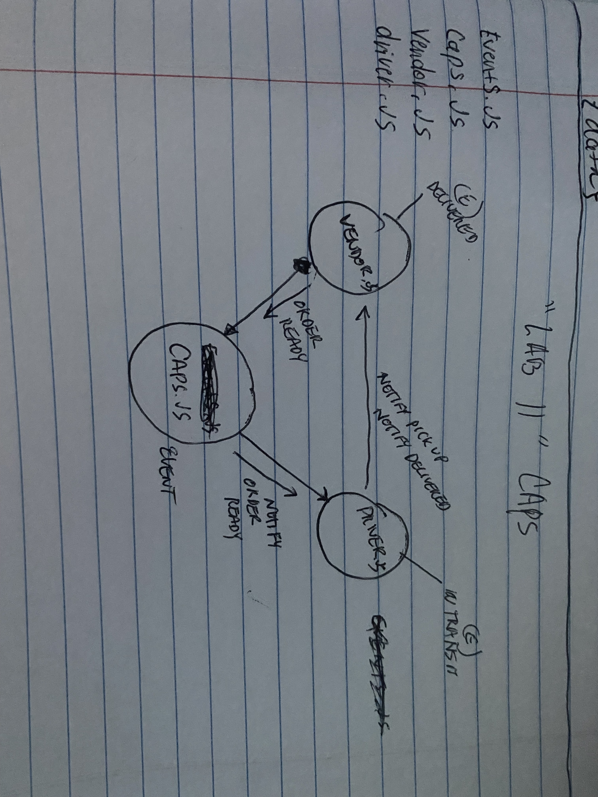

# 401 Lab 11
# Name of Lab
CAPS Event driven Application 

Create an application that will send an alert from the vendor to caps that a package needs to be picked up. Caps needs to require all of the handlers and act as a hub for the functions to be called. Caps will need to send to the driver the pick up info and then the driver will notifiy the vender if in transit and delivered. 
## Name: Sunny Lee 
### Setup
#### ENV Requirements
No env file was used. If it was to be used, I would enter a store name in the env varibale so that the store names can change. 
#### Running the App
The caps.js will essentially act as a server and have a handler for the pickup, in-transit, and delivered, with the payload passed into it which will have the payload data such as the order id and customer information. IN each module meaning the vender and the driver will have the simulated time outs and the console logs. The events.js will create a new event. 

use `npm test` to check to see if the events.emit is called. 
## UML

This is an update to test GitHub since repo update